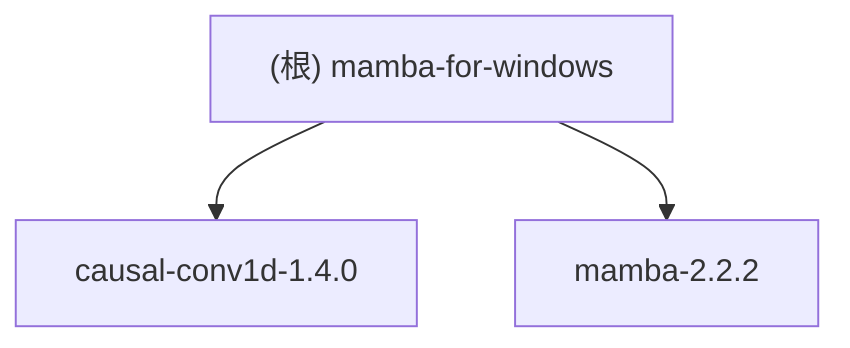

# mamba-for-windows

## 项目愿景
mamba-for-windows 是一个为在 Windows 系统上部署 Mamba 状态空间模型而准备的环境配置方案。该项目提供了在 Windows 平台上运行 Mamba 模型所需的所有依赖和配置，使开发者能够在 Windows 环境中顺利使用 Mamba 这一先进的序列建模架构。

## 架构总览
该项目由两个主要组件构成：
1. `causal-conv1d-1.4.0`: 一个CUDA加速的因果卷积1D实现，提供高效的PyTorch接口
2. `mamba-2.2.2`: Mamba模型的核心实现，包含Mamba1和Mamba2架构

整个项目基于状态空间模型（State Space Models）技术，特别适用于处理信息密集型序列数据，如语言建模，性能优于之前的子二次模型。

## 模块结构图

## 模块索引

| 模块路径 | 职责 | 主要文件 |
|---------|------|----------|
| causal-conv1d-1.4.0 | CUDA加速的因果卷积实现 | causal_conv1d_interface.py, .cu文件 |
| mamba-2.2.2 | Mamba模型核心实现 | mamba_simple.py, selective_scan_interface.py, mixer_seq_simple.py |

## 运行与开发
1. 环境要求:
   - Linux (虽然项目名为Windows，但实际要求Linux)
   - NVIDIA GPU
   - PyTorch 1.12+
   - CUDA 11.6+
   - Python 3.10

2. 安装步骤:
   - 先安装 causal-conv1d>=1.4.0
   - 然后安装 mamba-ssm

## 测试策略
- causal-conv1d 模块: 包含全面的测试用例，覆盖不同数据类型、激活函数、偏置设置等场景
- mamba 模块: 提供了生成性评估脚本和基准测试

## 编码规范
- Python代码遵循标准格式
- CUDA代码使用C++编写
- 使用PyTorch进行深度学习相关操作

## AI 使用指引
- 重点关注Mamba的状态空间模型实现
- 了解因果卷积的CUDA优化实现
- 可参考预训练模型的使用方式

## 变更记录 (Changelog)
- 2025-12-23 10:30:42: 初始化项目文档，识别核心模块结构